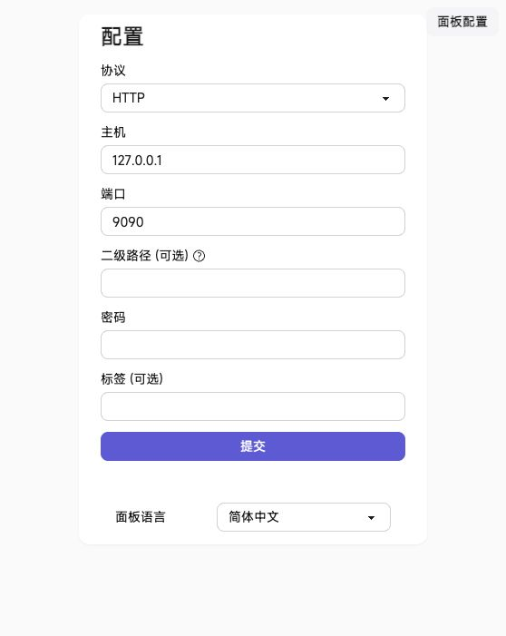

# sing-box-gateway-ui

`sing-box-gateway-ui` 是一个面向旁路代理/旁路网关场景的一键安装项目，集成 `sing-box`、TProxy、分流规则自动更新、规则管理 UI 和 9090 Clash API 面板。

设计目标是：**高效、简洁、sing-box 不死**。所有配置保存、规则更新和 TProxy 同步都应先检查、可回滚，避免因为错误输入导致正在运行的 `sing-box` 无法启动。

## 截图

规则管理 UI：


节点管理：


9090 zashboard 面板：



## 功能

- 一键安装 `sing-box` 二进制、systemd 服务、TProxy 和 Web UI
- 默认使用仓库内置并验证过的 `sing-box 1.13.13`，同时包含 `amd64` 和 `arm64`
- 规则 UI 管理白名单、黑名单、灰名单、DDNS 和代理节点
- 保存前执行 `sing-box check`，失败不覆盖正式配置
- 重启失败自动回滚上一份可用配置
- 节点页点击“设为默认”会立即保存、检查、重启并校验运行态；Auto 默认每 30 秒自动测速并重选可用节点，显示当前选中的实际节点，并在 urltest 选中节点变化时中断旧连接，避免继续粘在失效节点上
- DDNS 可选择本地 DNS 或经代理节点访问的远程 DNS
- TProxy 自动检测默认网卡、本机网段和 IPv6 前缀
- 节点服务器 IP 自动加入 TProxy bypass，避免代理链路被透明代理套住
- FakeIP 网段不绕过 TProxy，继续交给 `sing-box` 分流
- LAN 侧 TCP/UDP 53 会被重定向到 sing-box DNS，降低 IPv4/IPv6 明文 DNS 泄漏
- 安装器默认不把系统 DNS 指向本机、不广播 IPv6 网关，并会停止、mask 已存在但未显式启用的 `radvd`
- 分流规则定时更新，下载失败保留旧文件
- 维护页展示规则更新、TProxy、服务状态和节点服务器解析结果
- 内置 9090 Clash API 和 zashboard 静态面板
- `sing-box-gateway-info` 一键查看访问地址和密钥

## 透明网关 sysctl

安装器会自动写入透明网关/TProxy 必需的基础 sysctl 参数，用来开启 IPv4/IPv6 转发，关闭入口网卡反向路径过滤，并在开启 IPv6 forwarding 后继续接受上游路由器的 RA 默认路由。

这些参数不是测速优化项，而是透明网关正常工作的基础配置。请不要随意删除 `/etc/sysctl.d/99-sing-box-tproxy.conf`，否则重启后可能导致 LAN 客户端无法正常通过网关转发。

安装器不会默认启用 `radvd`，也不会把这台机器广播成 LAN 默认 IPv6 网关。如果目标机之前已经安装并启用了 `radvd`，安装器会在未显式 opt-in 时执行 `systemctl disable --now radvd.service` 和 `systemctl mask radvd.service`，防止旁路机误发 RA。家庭或生产网络里通常已经有前端软路由负责默认网关和 RA；如果多台机器同时广播默认 IPv6 网关，客户端可能选错出口，表现为网页打不开、IPv6/IPv4 选择异常或测速结果混乱。

自动生成的参数如下：

```conf
net.ipv4.ip_forward=1
net.ipv4.conf.all.rp_filter=0
net.ipv4.conf.default.rp_filter=0
net.ipv4.conf.eth0.rp_filter=0

net.ipv6.conf.all.forwarding=1
net.ipv6.conf.default.forwarding=1
net.ipv6.conf.eth0.forwarding=1
net.ipv6.conf.eth0.accept_ra=2
net.ipv6.conf.eth0.accept_ra_defrtr=1
```

其中 `eth0` 会按安装机的默认网卡自动生成。

## 支持系统

当前安装器面向 apt 系 Linux：

- Debian 12/13
- Ubuntu 22.04/24.04/25.04

需要 root 权限。

## 一键安装

推荐使用反代入口，适合新机器还没有代理环境、GitHub DNS 可能被污染的情况：

```bash
curl -fsSL https://scg.jgaga.tk/https://raw.githubusercontent.com/hanigege/sing-box-gateway-ui/main/scripts/quick-install.sh | sudo bash
```

如果当前机器直连 GitHub 稳定，也可以使用官方入口：

```bash
curl -fsSL https://github.com/hanigege/sing-box-gateway-ui/raw/refs/heads/main/scripts/quick-install.sh | sudo bash
```

安装器只使用仓库自带并验证过的 `sing-box 1.13.13`，不提供自动下载上游最新版，避免 sing-box 配置语法变化导致安装后无法启动。项目源码和 zashboard 下载会优先尝试反代地址，失败后再尝试 GitHub 官方地址。

安装器会交互式询问：

- CPU 架构，默认 `auto`，也可以手动选 `amd64` 或 `arm64`
- 是否使用简单模式，默认 yes
- sing-box 机器的 LAN IPv4 地址

简单模式会使用默认 FakeIP 网段和两个脱敏模板节点，让 `sing-box` 与 UI 先跑起来。模板节点不能直接代理流量，进入规则 UI 后，把 `TEMPLATE-HY2` 或 `TEMPLATE-VLESS` 改成自己的真实节点即可。

如果选择高级模式，安装器还会询问：

- FakeIP IPv4/IPv6 网段
- IPv6 DNS 监听地址，不需要可留空
- 是否使用模板节点，或手动输入节点 tag、server、端口和认证参数

安装过程中会先下载必需分流规则、生成 TProxy 规则脚本、检查 53 端口是否可用，并执行 `sing-box check`。如果 53 端口被 `systemd-resolved` 本地 stub 占用，安装器会明确提示正在关闭 `DNSStubListener`，释放成功后继续；如果被其它进程占用，会停止安装并提示用户先处理。检查不通过时不会启用服务。

### 安装后的 DNS 和网关

安装器默认不把宿主机 DNS 指向 sing-box 本机 IP，不写入公共 DNS，也不启用 `radvd` 广播默认 IPv6 网关。PVE 虚拟机、Cloud-Init、前端软路由、RouterOS、OpenWrt 等环境可以继续按原来的方式管理 DNS 和网关。

如果 53 端口被 `systemd-resolved` 的本地 stub 占用，安装器会在 `/etc/systemd/resolved.conf` 的 `[Resolve]` 段设置 `DNSStubListener=no`，随后自动重启 `systemd-resolved.service` 并等待 53 端口释放，把 53 端口留给 sing-box。安装输出会显示“正在检查 53 端口”“53 端口已释放”或具体占用进程，方便小白判断卡在哪里。这个动作不会把 DNS 改成公共 DNS，也不会改成 sing-box 本机 IP，也不会改写 `/etc/resolv.conf` 的指向；系统原有上游 DNS 仍由系统、Cloud-Init 或前端软路由配置决定。

相关配置位置：

- 当前系统 DNS 文件：`/etc/resolv.conf`，安装器不会写入公共 DNS 或 sing-box 本机 IP
- systemd-resolved 备份：`/etc/sing-box/manager/resolved.conf.before-sing-box`
- resolv.conf 备份：`/etc/sing-box/manager/resolv.conf.before-sing-box`
- sing-box 主配置：`/etc/sing-box/config.json`
- UI 管理配置：`/etc/sing-box/manager/`
- 自定义规则文件：`/etc/sing-box/custom-rules/`
- TProxy 脚本：`/usr/local/sbin/sing-box-tproxy-setup`
- TProxy sysctl：`/etc/sysctl.d/99-sing-box-tproxy.conf`

代理节点添加后，sing-box 机器本机的 DNS 不必须指向自己。更稳的做法通常是让宿主机继续使用原来的上游 DNS，例如 Cloud-Init、前端软路由、内网 DNS 或运营商 DNS；这样 sing-box 自己解析代理节点域名时不会形成自我依赖。

真正需要交给 sing-box 的，是希望被规则分流管理的客户端 DNS。只有客户端 DNS 请求最终进入 sing-box，白名单、黑名单、灰名单、FakeIP 和域名分流规则才会完整生效。实现方式可以是：

- 在客户端手动把 DNS 指向 sing-box 机器的内网 IPv4
- 在前端软路由上把客户端 DNS 转发到 sing-box
- 在前端软路由上劫持客户端 53 端口 DNS 到 sing-box

例如 sing-box 机器内网 IP 是 `192.168.1.2`，客户端或软路由可以按需配置：

```conf
nameserver 192.168.1.2
```

这一步不是安装必需项，也不是 sing-box 本机稳定提供代理服务的必需项。如果只是把 sing-box 服务和 UI 安装起来，不需要改 DNS；如果要让局域网客户端按域名规则和 FakeIP 分流，则客户端 DNS 必须最终进入 sing-box。没有配置真实代理节点前，不建议把客户端 DNS 指向 sing-box，否则国外网站或部分需要代理的域名可能解析成 FakeIP 但代理不可用，表现为网页打不开。

白名单、黑名单和灰名单除了域名规则，也支持 `IP/CIDR` 条目，例如 `203.0.113.0/24`。这类规则直接匹配真实目标 IP，适合游戏对局服务器、语音服务器或其他进入连接阶段后不再携带域名的流量。用于白名单时会在 FakeIP 代理规则之前强制直连；CIDR 必须写成真实网络地址，例如 `203.0.113.0/24`，不要写成 `203.0.113.7/24`。

测速类域名规则集 `geosite-speedtest` 默认直连，不压到代理节点上。测速页面或测速 App 会并发建立大量连接并主动打满带宽，如果走代理，容易把节点和 TProxy 链路占满，导致游戏、语音和其它实时业务延迟突然升高。

如果你确实需要让本机广播 IPv6 默认网关，可以自行安装 `radvd`，并在运行安装器、UI 或同步脚本时显式设置：

```bash
SING_BOX_GATEWAY_ENABLE_RADVD=1 python3 /usr/local/sbin/refresh-sing-box-runtime-config
```

显式开启后，同步逻辑会解除 `radvd.service` 的 mask，写入 `/etc/radvd.conf`，并执行 `systemctl enable --now radvd.service`。不设置该环境变量时，即使系统里已经存在 `radvd`，一键安装也会保持它关闭。

生产网络里不建议在多台旁路机上同时启用 RA 广播。一般更稳的做法是：前端软路由继续作为默认网关，只把 FakeIP 网段或指定流量路由到 sing-box 机器。

### IPv6 FakeIP 推荐配置

如果希望浏览器访问国外网站时优先显示和使用 IPv6 FakeIP，不建议长期使用默认示例网段 `2001:2::/64`。部分系统或浏览器会把这种特殊用途前缀排在 IPv4 FakeIP 后面，结果外网域名显示为 `28.x.x.x`。

更稳的做法是：从运营商下发给你的公网 IPv6 前缀里，挑一个没有分配给 LAN 的 `/64` 作为 IPv6 FakeIP。

脱敏示例：

```text
运营商下发前缀：2001:db8:1234:1000::/62
LAN 正在使用：  2001:db8:1234:1000::/64
IPv6 FakeIP 可用：2001:db8:1234:1001::/64
```

这个 `/62` 通常包含 4 个 `/64`：

```text
2001:db8:1234:1000::/64  # LAN 已用，不要拿来做 FakeIP
2001:db8:1234:1001::/64  # 可作为 IPv6 FakeIP
2001:db8:1234:1002::/64  # 可作为 IPv6 FakeIP
2001:db8:1234:1003::/64  # 可作为 IPv6 FakeIP
```

在规则 UI 的节点页里，把 FakeIP IPv6 网段改成未使用的那个 `/64`，例如：

```text
2001:db8:1234:1001::/64
```

同时，前端软路由必须把这个 IPv6 FakeIP `/64` 指回 sing-box 网关，否则客户端拿到 IPv6 FakeIP 后不会回到 `sing-box`。

RouterOS 示例，假设：

```text
sing-box 网关 ULA：fd00::2
IPv6 FakeIP 网段：2001:db8:1234:1001::/64
路由表名称：sing-box-v6
```

需要有一张指向 sing-box 网关的 IPv6 路由表：

```routeros
/ipv6/route/add dst-address=::/0 gateway=fd00::2 routing-table=sing-box-v6
```

再把 IPv6 FakeIP 网段送进这张表：

```routeros
/routing/rule/add dst-address=2001:db8:1234:1001::/64 action=lookup table=sing-box-v6
```

如果前端软路由继续负责局域网默认网关和 DNS，不希望客户端拿到 sing-box 的 IPv6 DNS，可以关闭 RouterOS 的 RDNSS/DHCPv6 其它配置提示：

```routeros
/ipv6/nd/set [find interface=bridge1] advertise-dns=no other-configuration=no managed-address-configuration=no
```

这样可以保留 sing-box 机器上的 IPv6 DNS 监听，例如 `fd00::2` 或 `fd88::6666`，但不会通过 RA/RDNSS 下发给客户端。客户端 DNS 仍由前端软路由、Cloud-Init 或你手动配置决定。

配置正确后，国外域名的解析结果通常会是：

```text
A    -> 28.x.x.x
AAAA -> 2001:db8:1234:1001::xxxx
```

国内域名则仍应返回真实国内 IPv4/IPv6 地址。这样既能保留 FakeIP 分流，又能让支持 IPv6 的客户端优先走 IPv6 FakeIP。

如需指定架构：

```bash
SING_BOX_ARCH=arm64 sudo bash scripts/install.sh
```

## 一键卸载

默认卸载会尽量恢复到安装前状态：停止并禁用本项目服务，清理 TProxy nft/routing 运行规则，按安装前记录恢复 `radvd` 状态，并删除本项目安装的 UI、systemd 单元、辅助脚本、运行配置、规则缓存、zashboard 文件和 `/etc/sing-box`。如果 `/usr/local/bin/sing-box` 或 apt 依赖包是本安装器新增的，也会一起删除；如果安装前已经存在，则默认保留，避免误删用户原有程序或系统基础包。

卸载脚本不会处理 `systemd-resolved` 的 53 端口设置。安装时如果为了释放 53 写入了 `DNSStubListener=no`，卸载时会保持这个保护状态，不改回 `yes`，也不重启 `systemd-resolved`。

新版本安装器会在 `/etc/sing-box/manager/install-state` 记录安装前状态，用于卸载时判断哪些文件和依赖可以安全删除。老版本安装没有这份记录时，卸载仍会清理本项目路径和服务，但不会猜测删除安装前状态不明的系统组件。

```bash
curl -fsSL https://scg.jgaga.tk/https://raw.githubusercontent.com/hanigege/sing-box-gateway-ui/main/scripts/quick-install.sh | sudo bash -s uninstall
```

如果没有安装状态记录，但你仍然确认要删除 `/usr/local/bin/sing-box`，可以使用 purge：

```bash
curl -fsSL https://scg.jgaga.tk/https://raw.githubusercontent.com/hanigege/sing-box-gateway-ui/main/scripts/quick-install.sh | sudo bash -s purge
```

直连 GitHub 稳定时也可以使用官方 purge 入口：

```bash
curl -fsSL https://github.com/hanigege/sing-box-gateway-ui/raw/refs/heads/main/scripts/quick-install.sh | sudo bash -s purge
```

## Git 安装

适合想修改脚本或参与开发的用户：

```bash
git clone https://github.com/hanigege/sing-box-gateway-ui.git
cd sing-box-gateway-ui
sudo bash scripts/install.sh
```

本地卸载：

```bash
sudo bash scripts/install.sh uninstall
sudo bash scripts/install.sh purge
```

## 访问入口

安装完成后会输出规则 UI token 和 9090 控制面板 secret。忘记也没关系，在网关机器上运行：

```bash
sing-box-gateway-info
```

默认入口：

```text
http://<网关IP>:9091/
http://<网关IP>:9090/ui/
```

## 服务

安装后会创建：

- `sing-box.service`
- `sing-box-tproxy.service`
- `singbox-rule-ui.service`
- `update-sing-box-rules-jsdelivr.timer`

常用检查命令：

```bash
systemctl status sing-box
systemctl status sing-box-tproxy
systemctl status singbox-rule-ui
systemctl list-timers update-sing-box-rules-jsdelivr.timer
sing-box-gateway-info
```

## 安全

不要把以下内容提交到公开仓库：

- 节点密码
- UUID
- Reality public key / short id
- UI token
- 真实服务器 IP
- 私有域名

本仓库只保存安装逻辑和通用模板，不包含任何可用代理节点或私人配置。
